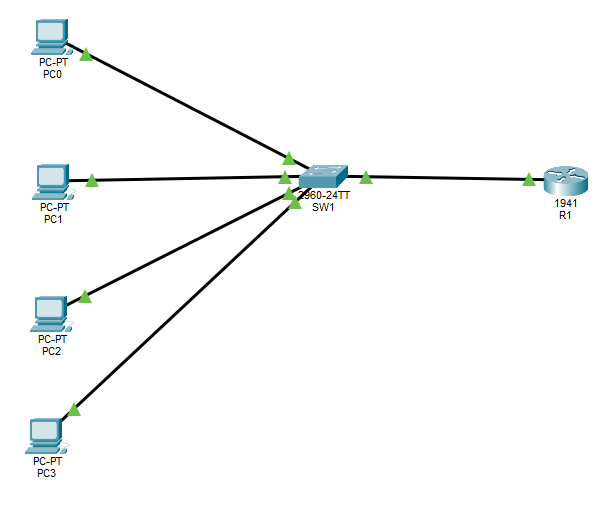

# 🔀 Inter VLAN Routing – Cisco Packet Tracer
This project demonstrates Inter-VLAN Routing using the Router-on-a-Stick method in Cisco Packet Tracer.

# 📌 Project Overview
A Cisco switch was configured with multiple VLANs, and a Cisco router was used to route traffic between the VLANs through a single trunk link. Devices in different VLANs were able to communicate successfully after configuring VLANs, trunking, subinterfaces, and gateway IP addresses.

# What I Did in This Project
- Create multiple VLANs on a switch.
- Assign switch ports to specific VLANs.
- Configure a trunk link between the switch and router.
- Configure Router-on-a-Stick using router subinterfaces.
- Enable communication between different VLANs.
- Verify connectivity using ping tests.

# Devices Used
- Cisco 2960 Switch
- Cisco 1941 Router
- 4 PCs
- Copper Straight-Through Cables
- Cisco Packet Tracer

#  Network Topology
```text
PC1 (VLAN 10) ----\
                   \
PC2 (VLAN 10) ----- Switch ---- Router (G0/0)
                   /
PC3 (VLAN 20) ----/
                  \
PC4 (VLAN 20) -----/

Switch Fa0/24 <---- Trunk Link ----> Router G0/0
```



# VLAN & IP Address Assignment
| Device | Department | VLAN | IP Address | Subnet Mask | Switch Port |
|--------|------------|------|--------------|-----------|--------------|
| PC0 | Sales | VLAN 10 | 192.168.10.2 | 255.255.255.0 | Fa0/1 |
| PC1 | Sales | VLAN 10 | 192.168.10.3 | 255.255.255.0 | Fa0/2 |
| PC2 | HR | VLAN 20 | 192.168.20.2 | 255.255.255.0 | Fa0/3 |
| PC3 | HR | VLAN 20 | 192.168.20.3 | 255.255.255.0 | Fa0/4 |

# Default Gateways
| VLAN | Department | Network Address | Default Gateway |
|------|------------|----------------|----------------|
| VLAN 10 | Sales | 192.168.10.0/24 | 192.168.10.1 |
| VLAN 20 | HR | 192.168.20.0/24 | 192.168.20.1 |

# Switch Configuration
**1. Create VLANs**
- Click on Switch
- Go to CLI tab
- Press Enter
- **Switch>** Prompt will shown
- Switch>**enable**
- Switch#**Configure terminal**
- Enter configuration commands, one per line. End with CNTL/Z.
- Switch(config)#**vlan 10**
- Switch(config-vlan)#**name SALES**
- Switch(config-vlan)#**exit**
- Switch(config)#**vlan 20**
- Switch(config-vlan)#**name HR**
- Switch(config-vlan)#**end (1 time) OR Control+Z OR exit (2 times) All three works. Ultimate Goal is to come back to Switch# prompt**
- press Enter
- Switch#**show vlan brief**
- **Output looks something like this**

| VLAN | Name | Status | Ports |
|------|------|--------|-------|
| 10 | Sales | active | |
| 20 | HR | active | |


**2. Assign the Ports**
- Click on Switch
- Go to CLI tab
- Press Enter
- **Switch>** Prompt will shown
- Switch>**enable**
- Switch#**Configure terminal**

- Switch(config)#**interface fastethernet0/1**
- Switch(config-if-range)#**switchport mode access**
- Switch(config-if-range)#**switchport access vlan 10**
- Switch(config-if-range)#**exit**

- Switch(config)#**interface fastethernet0/2**
- Switch(config-if-range)#**switchport mode access**
- Switch(config-if-range)#**switchport access vlan 10**
- Switch(config-if-range)#**exit**

- Switch(config)#**interface fastethernet0/3**
- Switch(config-if-range)#**switchport mode access**
- Switch(config-if-range)#**switchport access vlan 20**
- Switch(config-if-range)#**exit**

- Switch(config)#**interface fastethernet0/4**
- Switch(config-if-range)#**switchport mode access**
- Switch(config-if-range)#**switchport access vlan 20**
- Switch(config-if-range)#**end (1 time) OR Control+Z OR exit (2 times) All three works. Ultimate Goal is to come back to Switch# prompt**
- Press Enter
- Switch#**show vlan brief**
- **Output looks something like this**

| VLAN | Name | Status | Ports |
|------|------|--------|-------|
| 10 | Sales | active | fa0/1, fa0/2 |
| 20 | HR | active | fa0/3,fa0/4 |

**3. Trunk Port (Most Important)**

The trunk port is needed because a single switch port needs to carry traffic from multiple VLANs at the same time.
- Switch>**enable**
- Switch#**Configure terminal**
- Switch(config)#**interface fastethernet0/24**
- Switch(config-if-range)#**switchport mode trunk**
- Switch(config-if-range)#

**4. Verify Switch Trunk Port**
